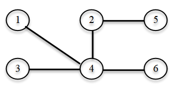
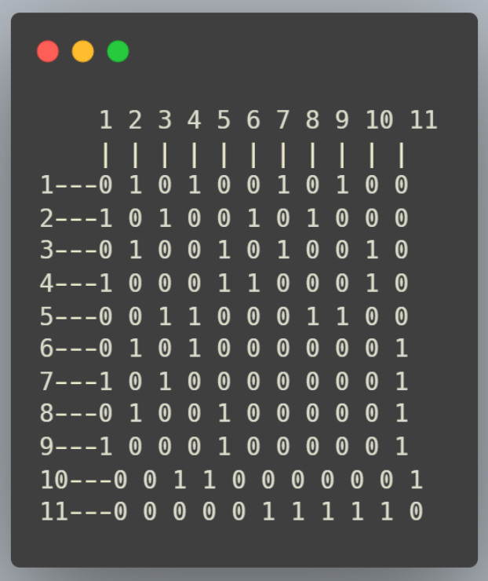
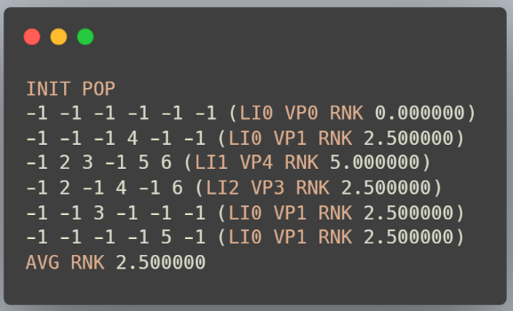

# What Maximum Stable Set Problem is
Formaly the problem is descrived as follows:
Given a undirectional graph 𝐺 = (𝑉, A), made of a set V of vertices connected between themselves by edges A, a subset 𝑆⊆𝑉 is called
stable set when there are no edges between the vertices of 𝑆. 
The problem's goal is to find a stable set 𝑆 so that it's cardinality (the number of vertces it contains) is maximum.
The goal of the Maximum Stable Set Problem is therefore of maximization.

For example, for this graph:

There exist the following solutions 
S1 = {1,3,5,6} and S2 = {1,2,3,6}.


# How it works

The code reads the graphs from text files that follow this structure:
```
c Exemplo
p edge 45 918
e 2 1
e 3 1
e 3 2
e 4 1
e 4 2
```
Where lines starting by ``c`` represent comments.\
The line starting with ``p`` indicates the number of vertices and edges.\
The lines starting by ``e`` represent edges.

The graph is represented by a 2d array. Where the value is 1 indicates a connection between those two nodes.\


## HillClimb Algorithm
The algo starts with a solution that contains every node.\
If that solution has links between any of its nodes it then checks all the neighbouring solutions.\
It does this by removing every possible node at a time. It will then pick the neighbour with the smallest number of links ( or in the case of a draw pick randomly from the ones with the least links ).\
This repeats until it reaches a solution with no links.\
To increase the likelihood of finding the optimal solution this process can be repeated multiple times.


## Genetic Algorithm
A population is initially created with random values.\
Each solution's fitness is calculated based on the amount of nodes and links it contains.\
The fittest solutions are more likely to pass to the next generation unaltered or to cross with another solution.\
Over enough generations the best solutions will be found.
To escape local maximum there is also a change that any given solution will suffer a random mutation.\



# How to use it
Open the project using Clion or an alternative solution and create the files using CMake, and the provided CMakeLists file.\
The variables used to tweak the algorithms' performance can be changed in the MiscellaneousFunctions.c control panel at the start of the file. 


# Results
Even for graphs with 300 nodes and 10933 links both the genetic and hillclimbing algorithms are able to find solutions efficiently and correctly.


